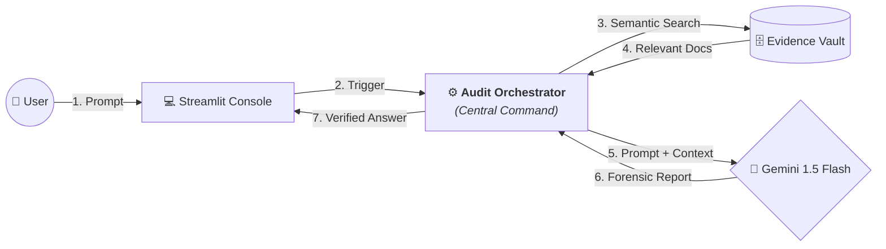

# ⚖️ Financial Intelligence Audit Suite

A forensic-grade RAG (Retrieval-Augmented Generation) system designed for deep financial analysis, mathematical reconciliation, and automated compliance auditing.

---

## 🚀 Simplified Forensic Audit Flow

### 📁 Data Flow Breakdown

| Step | Direction | Component Path | Detailed Explanation |
| :--- | :--- | :--- | :--- |
| **1** | **Inflow** | User → Console | The user submits a financial query or audit request via the UI. |
| **2** | **Inflow** | Console → Orchestrator | **Orchestrator Role**: Receives the raw request, initiates the logic flow, and prepares the query for semantic vectorization. |
| **3** | **Outflow** | Orchestrator → Vault | **Orchestrator Role**: Generates the search vector and executes the lookup in the database (Chroma/Azure). |
| **4** | **Inflow** | Vault → Orchestrator | The most relevant evidence snippets are retrieved and returned to the command center. |
| **5** | **Outflow** | Orchestrator → LLM | **Orchestrator Role**: Bundles the raw query + retrieved evidence into a structured "Audit Prompt" for the AI. |
| **6** | **Inflow** | LLM → Orchestrator | The AI performs a multi-pass forensic verification and returns the final reconciled report. |
| **7** | **Outflow** | Orchestrator → Console | The final verified answer is delivered back to the dashboard for user review. |

---

## 🏗️ Component Architecture (Layman's Perspective)

### 1. The Interactive Dashboard (Frontend)
*   **Tech Stack**: [Streamlit](https://streamlit.io/) (Python)
*   **Explanation**: The professional website where you upload files and view audit reports.

### 2. The Audit Orchestrator (Central Command)
*   **Tech Stack**: [Python](https://www.python.org/)
*   **Explanation**: The "Brain" of the operation. It coordinates all traffic between the UI, the Database, and the AI. It ensures that the right data gets to the right place at the right time.

### 3. The Digital Vault (Memory)
*   **Tech Stack**: [ChromaDB](https://www.trychroma.com/) / [Azure AI Search](https://azure.microsoft.com/en-us/products/ai-services/ai-search)
*   **Explanation**: A conceptual filing cabinet that stores the *meaning* of your documents for instant retrieval.

### 4. The Senior Auditor (Analytical Engine)
*   **Tech Stack**: [Google Gemini 1.5 Flash](https://deepmind.google/technologies/gemini/)
*   **Explanation**: The reasoning engine that performs mathematical reconciliation and writes the final audit findings.

---

## 🛠️ Setup & Installation
1. Clone the repository.
2. Install dependencies: `pip install -r requirements.txt`
3. Configure `.env`:
   * `GOOGLE_API_KEY`: Required for AI reasoning.
4. Run the suite: `streamlit run app.py`
