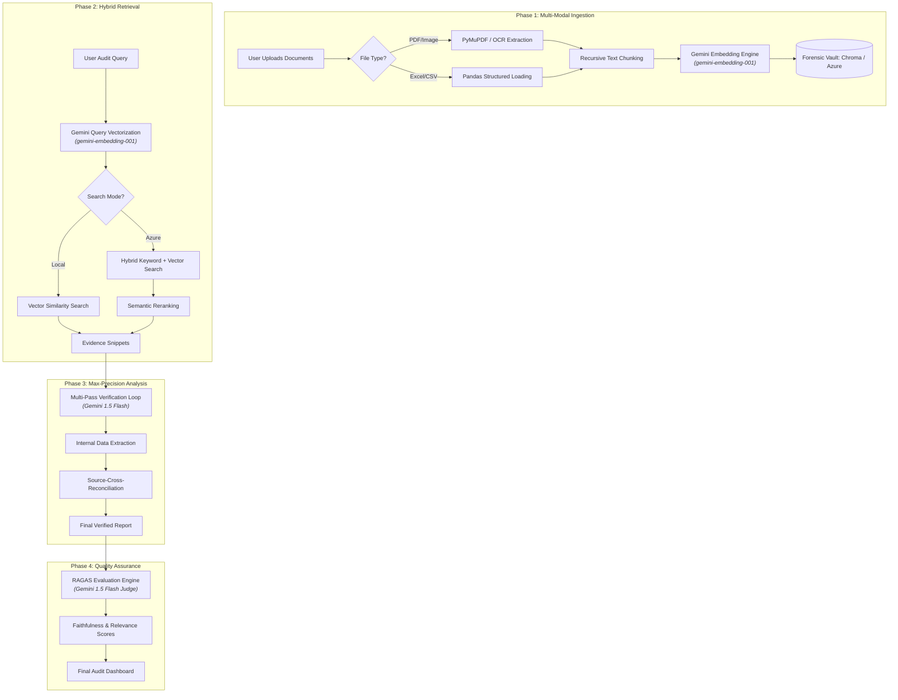

# ⚖️ Financial Intelligence Audit Suite

A forensic-grade RAG (Retrieval-Augmented Generation) system designed for deep financial analysis, mathematical reconciliation, and automated compliance auditing.

---

## 🗺️ End-to-End Forensic Workflow

---

## 🏗️ Component Architecture (Layman's Perspective)

### 1. The Interactive Dashboard (Frontend)
*   **Tech Stack**: [Streamlit](https://streamlit.io/) (Python)
*   **Layman Explanation**: This is the "Face" of the system. It’s like a professional website designed specifically for data. It handles your file uploads and displays the AI's reports in a clean, readable format.

### 2. The Senior Auditor (Analytical Engine)
*   **Tech Stack**: [Google Gemini 1.5 Flash](https://deepmind.google/technologies/gemini/)
*   **Layman Explanation**: This is the "Brain." It has been trained on trillions of words and understands complex accounting rules (IFRS/GAAP). We use a **Chain-of-Verification (CoVe)** process, meaning the AI doesn't just answer; it internally cross-checks its own math before showing you the result.

### 3. The Digital Vault (Vector Memory)
*   **Tech Stack**: [ChromaDB](https://www.trychroma.com/) (Local) or [Azure AI Search](https://azure.microsoft.com/en-us/products/ai-services/ai-search) (Enterprise)
*   **Layman Explanation**: This is the "Memory." Instead of searching for keywords like a 90s search engine, it stores the *meaning* of your documents as mathematical codes. This allows the AI to find relevant context (e.g., "revenue growth") even if the document uses different words like "increased turnover."

### 4. The Document Reader (Multimodal Loader)
*   **Tech Stack**: [PyMuPDF](https://pymupdf.readthedocs.io/), [Pandas](https://pandas.pydata.org/), [PIL](https://python-pillow.org/)
*   **Layman Explanation**: These are the "Eyes." They read messy PDFs, scan images for text, and parse through giant Excel spreadsheets, converting them into a format the AI can analyze.

### 5. The Quality Inspector (Evaluation Framework)
*   **Tech Stack**: [RAGAS](https://docs.ragas.io/)
*   **Layman Explanation**: This is the "Supervisor." For every answer the AI gives, RAGAS runs a background check to ensure it is **Faithful** (didn't make up numbers) and **Relevant** (actually answered your question).

---

## 🚀 Key Features
*   **Forensic Verification**: Mandatory multi-pass internal reconciliation of numerical data.
*   **Hybrid Search**: Combines keyword precision with semantic meaning (when using Azure).
*   **Auto-Indexing**: Zero-click document ingestion pipeline.
*   **Hallucination Shield**: Strict citation protocol for every claim.

## 🛠️ Setup & Installation
1. Clone the repository.
2. Install dependencies: `pip install -r requirements.txt`
3. Configure `.env`:
   * `GOOGLE_API_KEY`: Required for the Brain and Memory.
   * `AZURE_SEARCH_API_KEY`: Optional for Enterprise search.
4. Run the suite: `streamlit run app.py`
