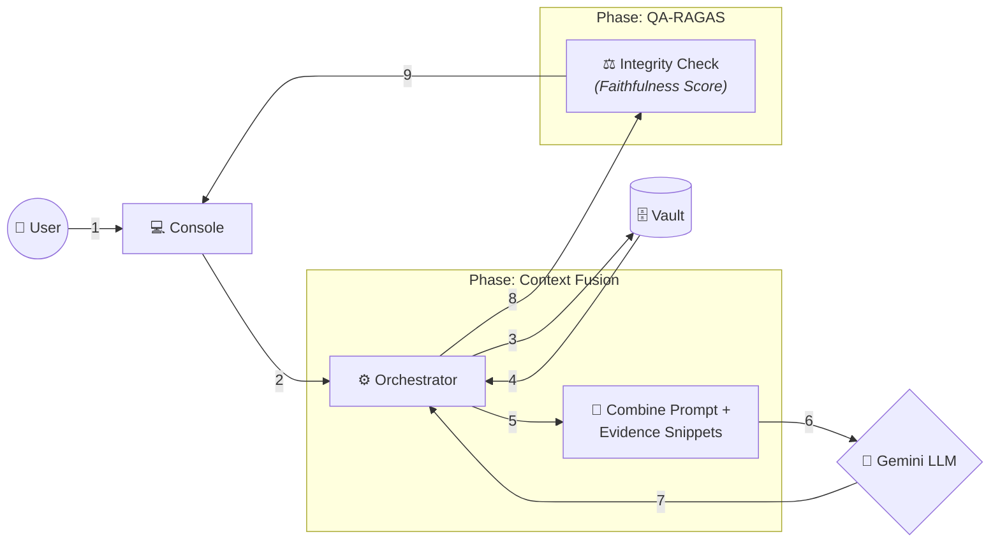

# ⚖️ Financial Intelligence Audit Suite

A forensic-grade RAG (Retrieval-Augmented Generation) system designed for deep financial analysis, mathematical reconciliation, and automated compliance auditing.

---

## 🚀 Simplified Forensic Audit Flow

### 📁 Data Flow Breakdown

| Step | Direction | Component Path | Detailed Explanation |
| :--- | :--- | :--- | :--- |
| **1** | **Inflow** | User → Console | User submits a financial audit query. |
| **2** | **Inflow** | Console → Orchestrator | The request is captured and the analytical pipeline starts. |
| **3** | **Outflow** | Orchestrator → Vault | Semantic search for evidence across all documents. |
| **4** | **Inflow** | Vault → Orchestrator | The most relevant evidence "chunks" are retrieved. |
| **5** | **FUSION** | Orchestrator → Fusion | **Context Fusion**: The system mathematically combines your query with the retrieved evidence snippets. |
| **6** | **Outflow** | Fusion → LLM | The "Augmented Prompt" is sent to Gemini for forensic analysis. |
| **7** | **Inflow** | LLM → Orchestrator | Gemini returns a reconciled forensic report with citations. |
| **8** | **QA-RAGAS** | Orchestrator → RAGAS | **Independent Audit**: RAGAS evaluates the report for accuracy and relevance. |
| **9** | **Outflow** | RAGAS → Console | The final verified answer + Quality Scores are displayed to the user. |

---

## 🏗️ Component Architecture (Layman's Perspective)

### 1. The Interactive Dashboard (Frontend)
*   **Tech Stack**: [Streamlit](https://streamlit.io/) (Python)
*   **Explanation**: The professional website where you upload files and view audit reports.

### 2. The Audit Orchestrator (Central Command)
*   **Tech Stack**: [Python](https://www.python.org/)
*   **Explanation**: The "Brain" of the operation. It coordinates all traffic between the UI, the Database, and the AI. It ensures that the right data gets to the right place at the right time.

### 3. The Digital Vault (Memory)
*   **Tech Stack**: [ChromaDB](https://www.trychroma.com/) / [Azure AI Search](https://azure.microsoft.com/en-us/products/ai-services/ai-search)
*   **Explanation**: A conceptual filing cabinet that stores the *meaning* of your documents for instant retrieval.

### 4. The Senior Auditor (Analytical Engine)
*   **Tech Stack**: [Google Gemini 1.5 Flash](https://deepmind.google/technologies/gemini/)
*   **Explanation**: The reasoning engine that performs mathematical reconciliation and writes the final audit findings.

---

## 🛠️ Setup & Installation
1. Clone the repository.
2. Install dependencies: `pip install -r requirements.txt`
3. Configure `.env`:
   * `GOOGLE_API_KEY`: Required for AI reasoning.
4. Run the suite: `streamlit run app.py`
